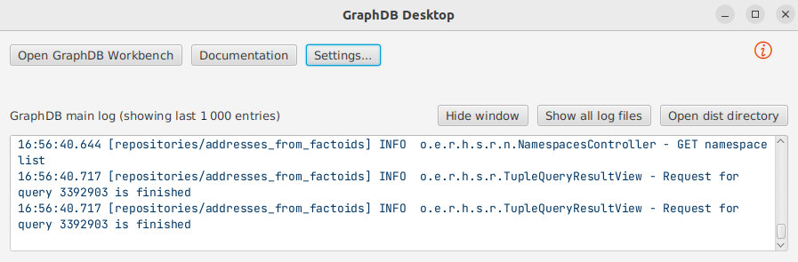
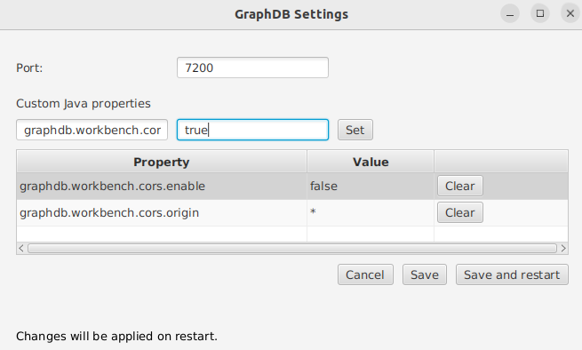

# Web visualisation for timeline

This repository contains the documentation of the PeGazUs (PErpetual GAZeteer of approach-address UtteranceS) ontology and knowledge graph construction method.

## Structure of the repository

📂 web-app  
├── 📄 [`README.md`](./README.md)  
├── 📄 [`index.html`](./index.html)  
├── 📂 [`scripts`](./scripts/)  
│   ├── 📄 [`func-evolution.js`](./scripts/func-evolution.js)  
│   ├── 📄 [`func-snapshot.js`](./scripts/func-snapshot.js)  
│   ├── 📄 [`geometry.js`](./scripts/geometry.js)  
│   ├── 📄 [`html-creator.js`](./scripts/html-creator.js)  
│   ├── 📄 [`html-utils.js`](./scripts/html-utils.js)  
│   ├── 📄 [`queries.js`](./scripts/queries.js)  
│   ├── 📄 [`script.js`](./scripts/script.js)  
│   └── 📄 [`time-slider.js`](./scripts/time-slider.js)  
├── 📂 [`libs`](./scripts/libs/)    
│   ├── 📂 [`leaflet`](./libs/leaflet/)   
│   ├── 📂 [`timelineJS`](./libs/timelineJS/)  
│   ├── 📄 [`jquery.js`](./libs/jquery.js)  
│   ├── 📄 [`proj4.js`](./libs/proj4.js)  
│   ├── 📄 [`terraformer.js`](./libs/terraformer.js)  
│   └── 📄 [`terraformer-wkt-parser.js`](./libs/terraformer-wkt-parser.js)  
├── 📂 [`styles`](./styles/)   
│   ├── 📄 [`style.css`](./styles/style.css)  
├── 📂 [`symbols`](./symbols/)  
└── 📄 [`settings.js`](./settings.js)  

### `styles` - CSS files for styling the webpage
This folder contains the CSS styles for the visual presentation of the application.
- **`style.css`**: The main CSS file that defines the general style of the web application. It controls the overall look and feel of the user interface, such as layout, colors, fonts, etc.

### `libs`: This subfolder contains the third-party JavaScript libraries used in the project.
- **`leaflet`**: Folder to use the [Leaflet](https://leafletjs.com/) library (version [1.9.4](https://unpkg.com/leaflet@1.9.4/dist/leaflet.js)), which is used to display interactive maps, it contains **`leaflet.js`** and **`leaflet.css`**.
- **`timelineJS`**: Folder to use [Timeline.js](https://timeline.knightlab.com/), a JavaScript library for creating interactive timelines. it contains **`timeline.js`** and **`timeline.css`**.
- **`jquery.js`**: File to use the [jQuery](https://jquery.com/) library (version 3.6.1), which simplifies DOM manipulation and event handling.
- **`proj4.js`**: [Proj4js](https://github.com/proj4js/proj4js) library (version [2.9.0](https://cdnjs.cloudflare.com/ajax/libs/proj4js/2.9.0/proj4.js)), a JavaScript library to transform point coordinates from one coordinate system to another.
- **`terraformer-wkt-parser.js`**: [Terraformer Well-Known Text Parser](https://github.com/Esri/terraformer-wkt-parser) library (version [1.1.2](https://unpkg.com/terraformer-wkt-parser@1.1.2/terraformer-wkt-parser.js)), a JavaScript library to parse Well-Known Text (WKT) into geo-objects.
- **`terraformer.js`**: [Terraformer](https://github.com/terraformer-js/terraformer) library (version [1.0.9](https://unpkg.com/terraformer@1.0.8/terraformer.js)), a geographic toolkit for working with geometry, geography, formats, and building geodatabases.

### `scripts` - JavaScript files for the functionality of the application
This folder contains the JavaScript files necessary for managing user interactions and the core functionality of the site.

- **`func-evolution.js`**: Functions to handle landmark evolutions in the application.
- **`func-snapshot.js`**: Functions to manage snapshot selection and handling.
- **`geometry.js`**: Functions to work with geometries, such as geometric transformations.
- **`html-creator.js`**: Functions to initialize HTML page
- **`html-utils.js`**: Functions to create HTML elements
- **`leaflet-objects.js`**: provides predefined marker icons and polygon styles for use in Leaflet maps, facilitating consistent visual customization.
- **`queries.js`**: Functions to build and handle SPARQL queries for querying a graph database.
- **`script.js`**: Main script to be executed when the webpage is loaded.
- **`time.js`**: Functions to manage time-related features in the application.
- **`time-slider.js`**: Functions for controlling and managing the time slider.
- **`utils.js`**: Utility functions that support the app’s general operations.

### `symbols` - Folder containing symbols used to be displayed on the page
This symbols contains icons or graphical symbols intended for display on the page.

### `settings.js` - Configuration file for the GraphDB repository
This file contains the settings for connecting and interacting with the GraphDB repository, including the URL, language, and repository name.

### `index.html` - Main webpage
This is the HTML file that loads the web application, containing the structure and layout of the webpage.

## Requirements

Before launching the web app, make sure `settings.js` is filled in according to the way you connect to your data source.

In all cases, the following values must be defined:
* `graphLang`: language of the graph, used to retrieve labels in the right language;
* `systemLang`: language of the system, used to display labels in the right language if it differs from `graphLang`;
* `gregorianCalendarURI`: URI of the Gregorian calendar.
* `defaultFinalGraphURI`: the URI of the graph used by default for the final construction;

`defaultFinalGraphURI` is optional. If the graph does not contain any explicit final graph declaration, that URI is used as the default final graph. If at least one graph `?g` is explicitly declared as a final graph, with a statement such as `?g a peg:FinalGraph`, then the application displays a dropdown menu listing all the final graphs found and lets you choose among them.

There are two possible configurations:

1. **You use a generic SPARQL endpoint**
    In this case, fill in:
    * `endpointURI`: the URL of the SPARQL endpoint to query;

2. **You use a local GraphDB instance**
    In this case, the endpoint is built from:
    * `graphDBURI`: the URL of the local GraphDB instance;
    * `graphName`: the name of the GraphDB repository.

    When using GraphDB locally, `endpointURI` should be undefined since it is automatically constructed : `${graphDBURI}/repositories/${graphName}`. You still need to define `defaultFinalGraphURI`, `lang`, and `namedGraphName` as above. You also need to configure GraphDB to avoid CORS errors.

To allow the web app to interact with a local GraphDB repository, open `Settings...` in the GraphDB Desktop window.

Then add the following properties:

Properties are the following ones:
* `graphdb.workbench.cors.enable`:`true` 
* `graphdb.workbench.cors.origin`:`*`

Now you can launch the web app.

